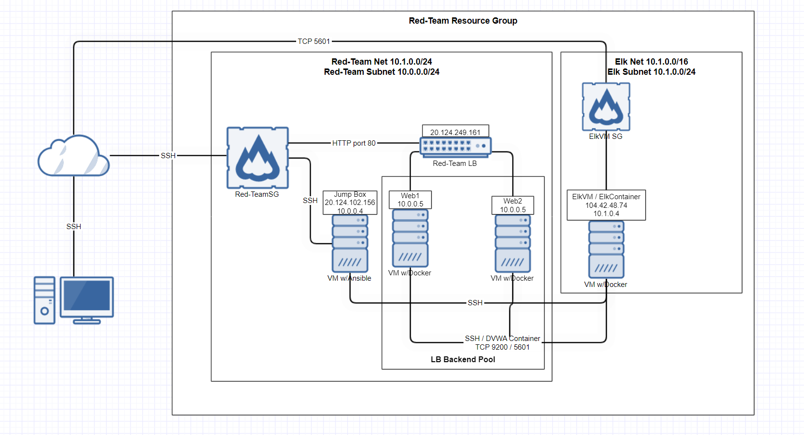

## Automated ELK Stack Deployment

The files in this repository were used to configure the network depicted below.

These files have been tested and used to generate a live ELK deployment on Azure. They can be used to either recreate the entire deployment pictured above. Alternatively, select portions of the ansible file may be used to install only certain pieces of it, such as Filebeat.

  

This document contains the following details:
- Description of the Topology
- Access Policies
- ELK Configuration
  - Beats in Use
  - Machines Being Monitored
- How to Use the Ansible Build

### Description of the Topology

The main purpose of this network is to expose a load-balanced and monitored instance of DVWA, the D*mn Vulnerable Web Application.

Load balancing ensures that the application will be highly avilable, in addition to restricting inbound access to the network.
- Load balancing is the process of distributing network traffic across multiple servers

Integrating an ELK server allows users to easily monitor the vulnerable VMs for changes to the file systems of the VMs on the network and system logs.
- Filebeat offers a lightweight way to forward and centralize logs and files
- Metricbeat collects metrics from systems and service

The configuration details of each machine may be found below.
- Note: Use the [Markdown Table Generator](http://www.tablesgenerator.com/markdown_tables) to add/remove values from the table.

| Name     | Function | IP Address | Operating System |
|----------|----------|------------|------------------|
| Jump Box | Gateway  | 10.0.0.4   | Linux            |
| Web 1    |Web Server| 10.0.0.5   | Linux            |
| Web 2    |Web Server| 10.0.0.6   | Linux            |
| ELK      |Monitoring| 10.1.0.4   | Linux            |

### Access Policies

The machines on the internal network are not exposed to the public Internet. 

Only the Jump Box machine can accept connections from the Internet. Access to this machine is only allowed from the following IP addresses:
- My public IP: 20.124.102.156

Machines within the network can only be accessed by each other.
- We access our ELK VM by ssh from our Jumb Box 10.0.0.4

A summary of the access policies in place can be found in the table below.

| Name     | Publicly Accessible | Allowed IP Addresses |
|----------|---------------------|----------------------|
| Jump Box |       Yes           |    20.124.102.156    |
| Web 1    |       No            |      10.0.0.4        |
| Web 2    |       No            |      10.0.0.4        |
| ELK      |       No            |      10.0.0.4        |

### Elk Configuration

Ansible was used to automate configuration of the ELK machine. No configuration was performed manually, which is advantageous because...
- we can apply same ruleset and commnand line for each new virtual machine that we create.

The playbook implements the following tasks:
- Install Docker
- Install python3-pip
- Increase Virtual Memory (sysctl -w vm.max_map_count=262144)
- Install elk container
- Enable docker to start on boot

The following screenshot displays the result of running `docker ps` after successfully configuring the ELK instance.

### Target Machines & Beats
This ELK server is configured to monitor the following machines:
- Web-1 (10.0.0.5) and Web-2 (10.0.0.6)

We have installed the following Beats on these machines:
- Filebeat and Metricbeat

These Beats allow us to collect the following information from each machine:
- Filebeat collects log & file data which can be used to monitor and track any unusual behaviour. Filebeat will allow you to view syslog events from each individual host in real time.

### Using the Playbook
In order to use the playbook, you will need to have an Ansible control node already configured. Assuming you have such a control node provisioned: 

SSH into the control node and follow the steps below:
- Copy the /etc/ansible/files/filebeat-config.yml file to /etc/filebeat/filebeat.yml.
- Update the config file to include elk server ip for output.elasticsearch and setup.kibana.
- Run the playbook, and navigate to Kibana (http://[ELKvmPublicIP]:5601/app/kibana#) to check that the installation worked as expected.
